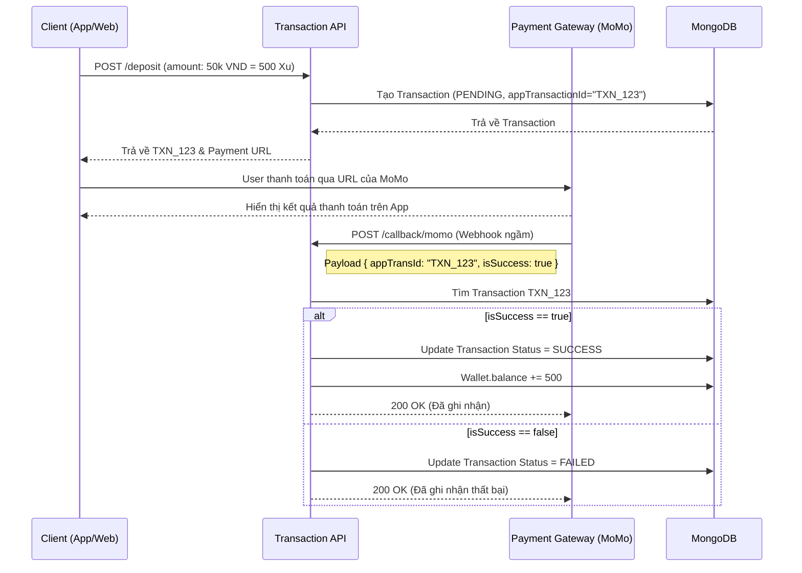
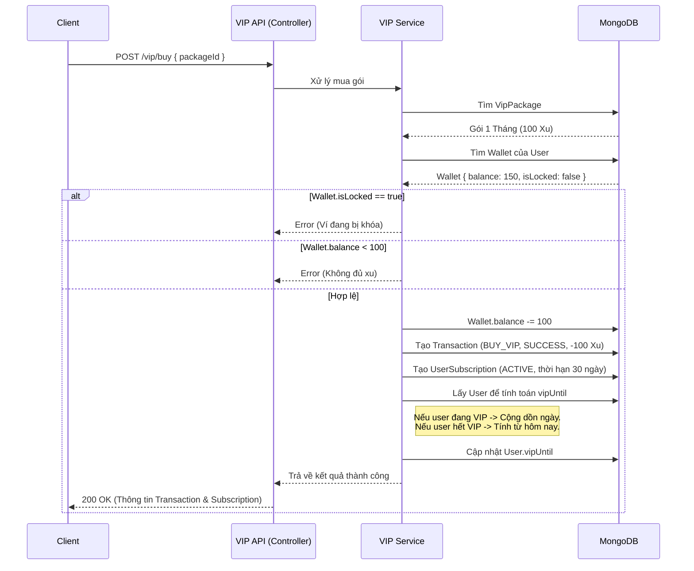

# Payment & VIP API Documentation

Phần quản lý Nạp Xu và Mua VIP sử dụng luồng Orchestration kết hợp nhiều Models (`Transaction`, `Wallet`, `VipPackage`, `UserSubscription`, `User`).

---

## 1. Transactions (`/api/transactions`)

### 1.1 Tạo yêu cầu Nạp Xu
- **Method:** `POST`
- **Endpoint:** `/api/transactions/deposit`
- **Headers:** `Authorization: Bearer <token>`
- **Mô tả:** User chọn gói nạp tiền. API tạo Transaction trạng thái `PENDING`.
- **Body:**
  ```json
  {
    "paymentMethod": "MOMO",
    "amountMoney": 50000,
    "amountCoins": 500
  }
  ```
- **Response:** Trả về `Transaction` object chứa `appTransactionId` (Mã đơn hàng nội bộ để gửi lên cổng thanh toán).

### 1.2 Webhook từ Cổng thanh toán (Callback)
- **Method:** `POST`
- **Endpoint:** `/api/transactions/callback/:method` (Ví dụ: `/callback/momo`)
- **Mô tả:** Cổng thanh toán gọi API này khi giao dịch thành công/thất bại.

#### 🔄 Sequence Diagram: Luồng Nạp Xu (Deposit)



---

## 2. VIP Subscription (`/api/vip`)

### 2.1 Lấy danh mục Gói VIP
- **Method:** `GET`
- **Endpoint:** `/api/vip/packages`
- **Mô tả:** Lấy danh sách các gói VIP đang mở bán (`isActive = true`). Public API.

### 2.2 Mua gói VIP bằng Xu
- **Method:** `POST`
- **Endpoint:** `/api/vip/buy`
- **Headers:** `Authorization: Bearer <token>`
- **Mô tả:** Sử dụng số dư trong Ví (Wallet) để mua gói VIP.
- **Body:**
  ```json
  {
    "packageId": "61a2b3..."
  }
  ```

#### 🔄 Sequence Diagram: Luồng Mua VIP (Buy VIP Orchestration)


