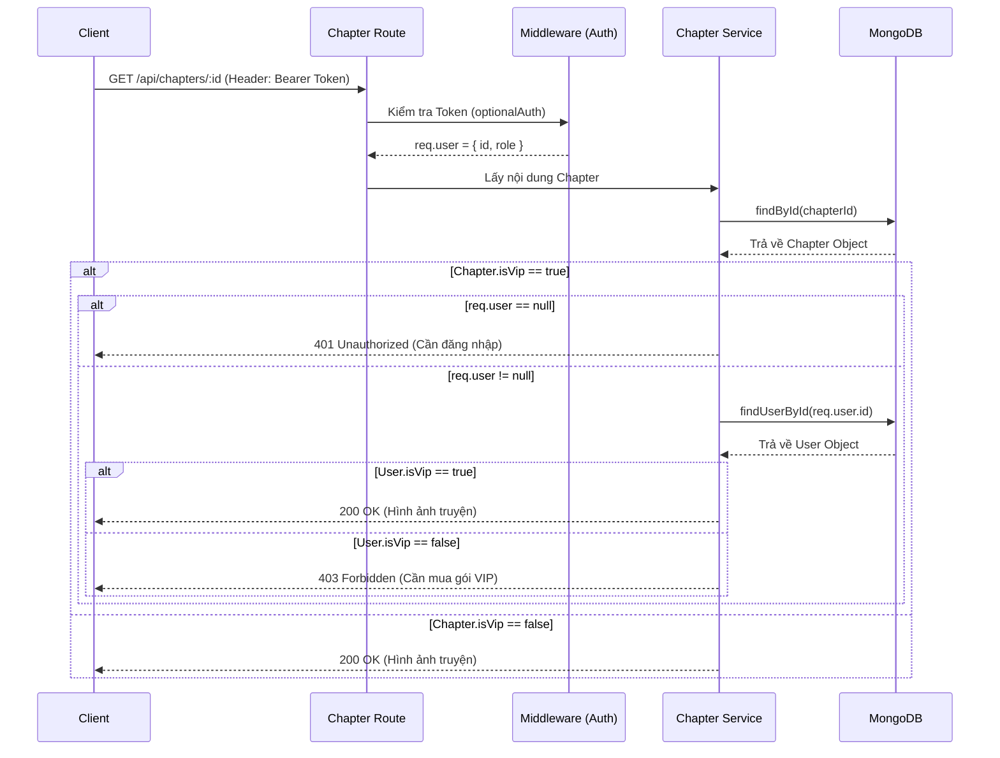

# Story & Chapter API Documentation

## 1. Story (`/api/stories`)

### 1.1 Lấy danh sách truyện
Các API public không cần token. Mỗi truyện trả về sẽ kèm theo 1 Chapter mới nhất (`latestChapter`).
- `GET /api/stories/`: Tất cả truyện.
- `GET /api/stories/hot`: Top 5 truyện có `views` cao nhất.
- `GET /api/stories/recent`: Top 10 truyện cập nhật gần đây (Kèm 3 chapters mới nhất).
- `GET /api/stories/random`: Lấy ngẫu nhiên 10 truyện (Cho tính năng Featured).
- `GET /api/stories/search?keyword=abc`: Tìm kiếm theo tên truyện.

### 1.2 Chi tiết truyện
- **Method:** `GET`
- **Endpoint:** `/api/stories/:id`
- **Mô tả:** Lấy thông tin chi tiết. Khi gọi API này, hệ thống sẽ:
  1. Tự động `views += 1`.
  2. Aggregation tính `averageRating` và `ratingCount` từ Collection `Rating`.
  3. Tính `bookmarkCount` từ Collection `Bookmark`.
- **Response (200 OK):**
  ```json
  {
    "_id": "60d5ec...",
    "title": "Solo Leveling",
    "views": 1500,
    "averageRating": 4.8,
    "ratingCount": 120,
    "bookmarkCount": 500,
    "genres": ["Action", "Fantasy"]
  }
  ```

### 1.3 Admin API (Yêu cầu `role="admin"`)
- `POST /api/stories/`: Tạo truyện mới (tự tạo `slug` từ `title`).
- `PUT /api/stories/:id`: Cập nhật truyện.
- `DELETE /api/stories/:id`: Xóa truyện (Tự động xóa tất cả chapters liên quan).

---

## 2. Chapter (`/api/chapters`)

### 2.1 Lấy danh sách Chapter của một truyện
- **Method:** `GET`
- **Endpoint:** `/api/chapters/story/:storyId`

### 2.2 Đọc nội dung Chapter (CÓ KIỂM TRA VIP)
- **Method:** `GET`
- **Endpoint:** `/api/chapters/:id`
- **Headers:** `Authorization: Bearer <token>` (Tùy chọn nếu truyện không khóa VIP, Bắt buộc nếu truyện khóa VIP).
- **Mô tả:** Trả về nội dung (hình ảnh) của chapter. API tự động tăng view cho Story tương ứng.

#### 🔄 Sequence Diagram: Đọc Chapter VIP



### 2.3 Admin API (Yêu cầu `role="admin"`)
- `POST /api/chapters/`: Tạo chapter mới. Mongoose Hook `post('save')` tự động tăng `chapterCount` của Story.
- `PUT /api/chapters/:id`: Sửa chapter.
- `DELETE /api/chapters/:id`: Xóa chapter. Mongoose Hook `post('findOneAndDelete')` tự động giảm `chapterCount`.
